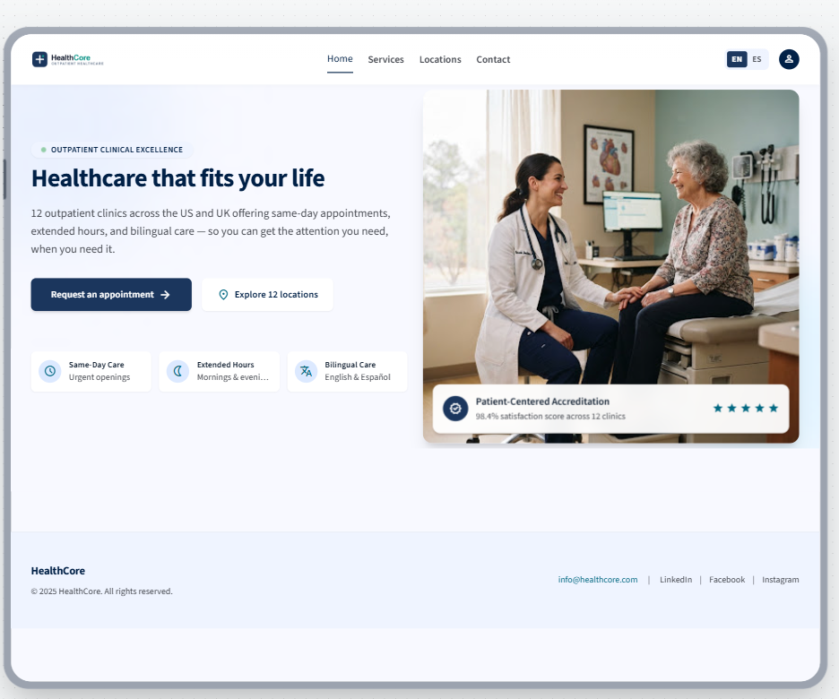
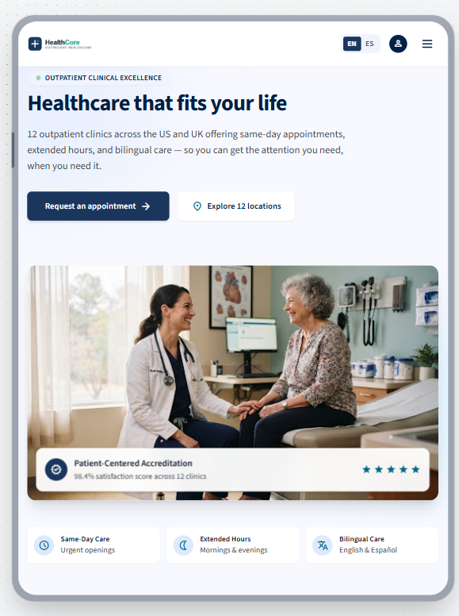
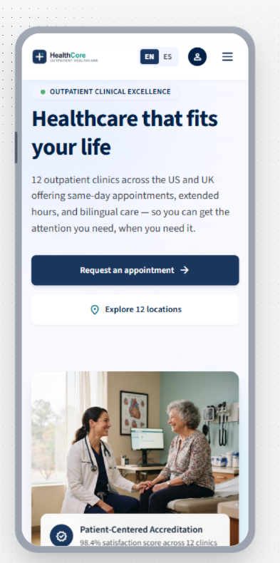
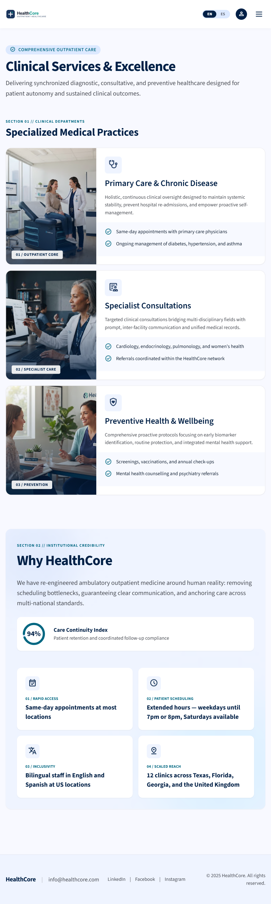
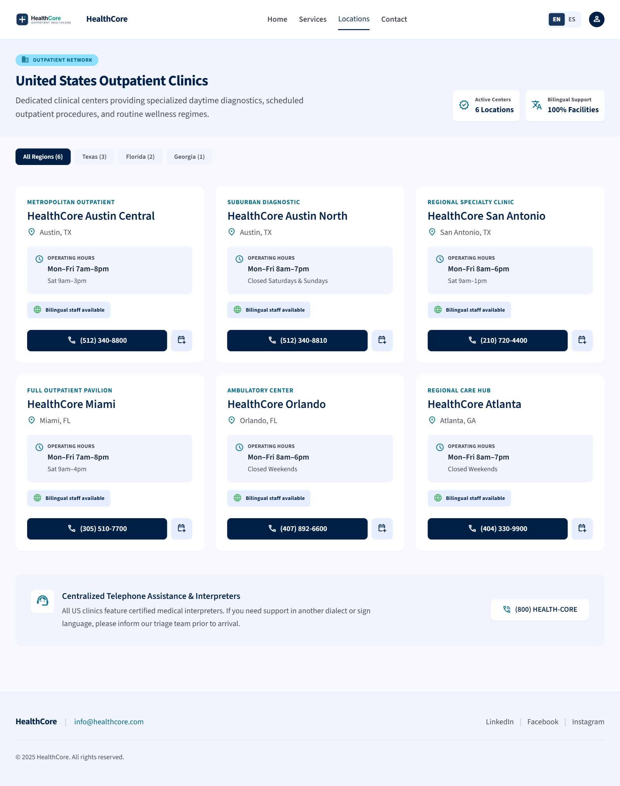
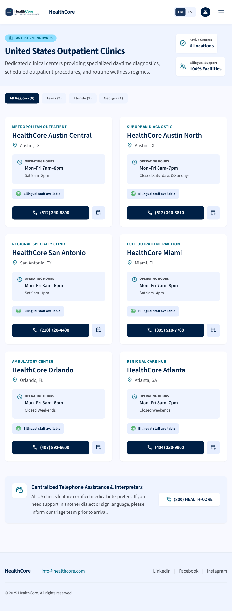
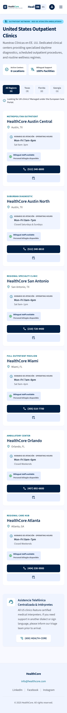
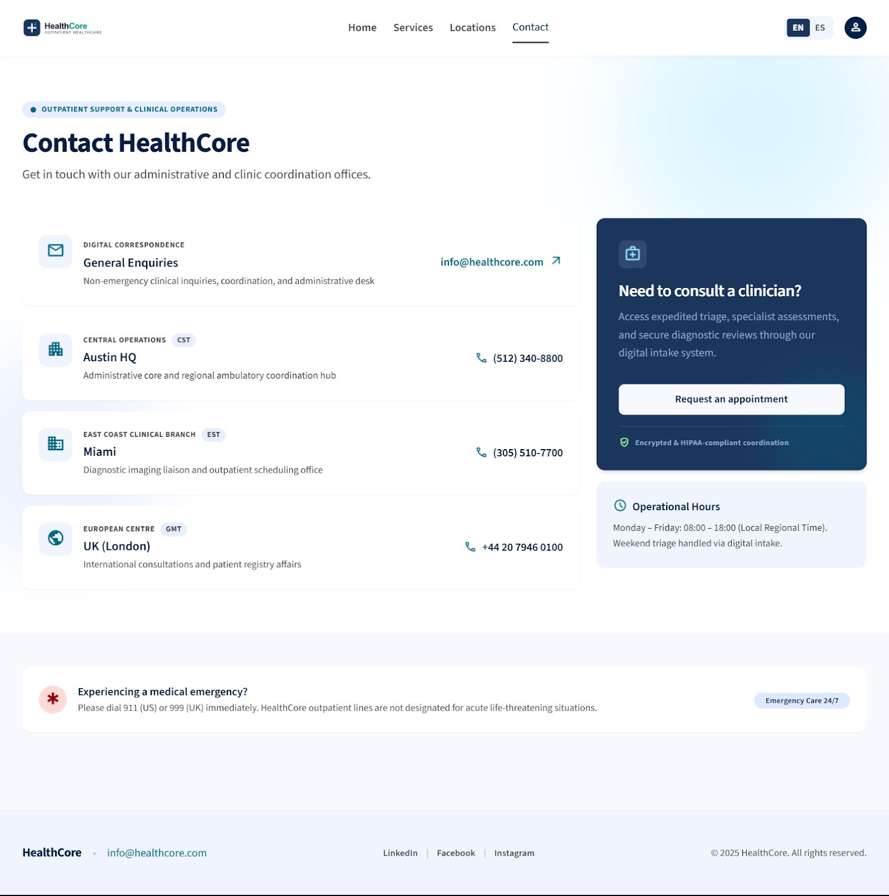
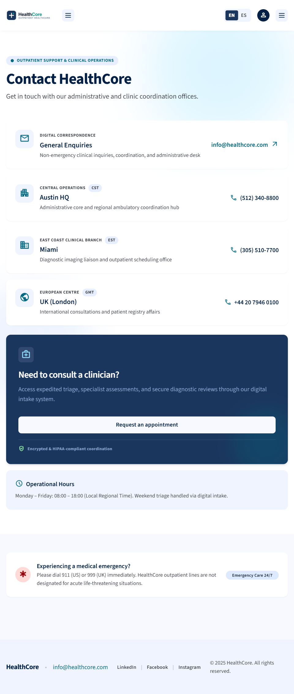
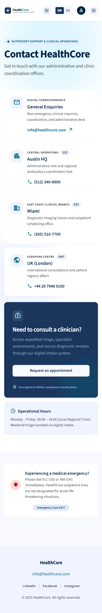

# HealthCore Public Website

This folder contains HealthCore's public-facing website for patients and visitors. It is separate from the future internal `backoffice` application under `uis/`.

## Current scope

The current milestone includes:

- A responsive home page for desktop, tablet, and mobile
- A shared header and footer loaded into each page with vanilla JavaScript, using the Home UI/UX reference consistently across all four pages
- A hamburger navigation menu for mobile and tablet
- Active navigation styling for standard `.html` and clean URLs
- A hero section with appointment and location calls to action
- Key outpatient care benefits
- A contact call to action and professional footer
- A responsive Services page with three specialized medical practice cards and a Why HealthCore section
- A responsive Locations directory with six US clinic cards, region filters, and phone links
- A responsive Contact page with office contact links, appointment guidance, operating hours, and emergency information

The appointment enquiry form will be implemented in a later milestone. Locations and Contact appointment links currently lead to the application placeholder.

## Technology

- Semantic HTML5
- Tailwind CSS through the CDN
- Lucide icons through the CDN
- Vanilla JavaScript for loading shared components, responsive navigation, and active-page styling

No build step is currently required.

## Project structure

```text
website/
├── index.html
├── services.html
├── locations.html
├── contact.html
├── application.html
├── README.md
├── components/
│   ├── header.html
│   └── footer.html
├── css/
├── js/
│   ├── components.js
│   ├── main.js
│   ├── locations.js
│   ├── tailwind-config.js
│   └── validation.js
└── public/
    ├── images/
    │   ├── home-hero.jpg
    │   ├── preventive-care.jpg
    │   ├── preventive-care-tablet.jpg
    │   ├── primary-care.jpg
    │   ├── primary-care-tablet.jpg
    │   ├── specialist-care.jpg
    │   └── specialist-care-tablet.jpg
    └── ui-ux/
        ├── home/
        │   ├── home_desktop.PNG
        │   ├── home_mobile.PNG
        │   ├── home_mobile_tablet_menu.PNG
        │   └── home_tablet.PNG
        ├── locations/
        │   ├── locations_desktop.png
        │   ├── locations_mobile.png
        │   └── locations_tablet.png
        └── services/
            ├── services_destop.png
            ├── services_mobile.png
            └── services_tablet.png
```

- `components/header.html` and `components/footer.html` contain the reusable site layout.
- `js/components.js` loads the shared components and controls navigation behavior.
- `js/tailwind-config.js` contains the shared Tailwind theme configuration.
- `js/main.js` is reserved for future page-specific behavior.
- `js/locations.js` filters clinic cards by region and announces the visible result count.
- `application.html` and `js/validation.js` are reserved for the future appointment enquiry form.
- Locations page styling uses Tailwind utility classes directly in `locations.html`; the shared header and footer are used without page-specific overrides.
- Contact page styling uses Tailwind utility classes directly in `contact.html`; the shared header and footer are used without page-specific overrides.
- `public/ui-ux/` contains the responsive UI/UX references for each implemented page.

## Run the website

From the repository root, start a local static server with:

```powershell
npx serve uis/website
```

The first run may ask for permission to download the `serve` package. This package is run through the npm cache and is not added to the project dependencies.

Open the local URL printed in the terminal, usually:

```text
http://localhost:3000
```

Press `Ctrl+C` in the terminal to stop the server.

Alternatively, run the website with Python without downloading an npm package:

```powershell
python -m http.server 8000 --directory uis/website
```

Then open `http://localhost:8000`.

## HealthCore UI/UX reference

### Home

The screenshots in [`public/ui-ux/home`](./public/ui-ux/home/) are the visual reference for implementing and reviewing the HealthCore home page. The interface uses a calm healthcare palette with navy primary actions, teal accents, pale blue surfaces, generous whitespace, and clear typography.

#### Desktop



- The top header displays the compact HealthCore logo, centered navigation links and account icon.
- The hero uses a two-column layout: headline, description, calls to action, and benefits on the left; patient photography and accreditation details on the right.
- The footer places company information on the left and contact and social links on the right.

#### Tablet



- The hero changes to a single-column layout, with the text and actions above the image.
- The main navigation moves into a hamburger menu while the logo and account icon remain visible.
- Benefit items remain in a three-column row beneath the hero image.

#### Mobile



- Content is stacked vertically for a narrow viewport, with readable spacing and no horizontal scrolling.
- Both calls to action become full-width controls for easier touch interaction.
- The hero image follows the text and actions, while the accreditation panel remains overlaid near the bottom of the image.

#### Mobile and tablet menu


- The hamburger opens the primary navigation directly beneath the top header.
- Home, Services, Locations, and Contact appear as large vertical menu targets.
- The active page uses a pale blue background, and the menu does not replace or hide the header controls.

### Services

The screenshots in [`public/ui-ux/services`](./public/ui-ux/services/) are the visual reference for implementing and reviewing the Services page. The design continues the navy and teal palette with a pale page background, white medical practice cards, and a rounded Why HealthCore panel with soft blue corner glows.

The page introduces Clinical Services & Excellence, followed by Specialized Medical Practices and Why HealthCore. The three practice cards cover primary care and chronic disease, specialist consultations, and preventive health and wellbeing. Why HealthCore presents the care continuity metric and four benefits: same-day access, extended hours, bilingual care, and the clinic network. The 94% metric reproduces the reference design's sample content.

#### Desktop


- The header displays the logo, navigation with Services highlighted and account icon.
- Three medical practice cards sit side by side, each with a photo and category label above its icon, heading, description, and shaded list of included services.
- The reference places an Accredited Outpatient Network label beside the clinical departments heading.
- Why HealthCore uses two columns: the introduction and care continuity metric on the left, and a two-by-two benefit card grid on the right.
- The reference footer places the brand and email on the left, social links in the center, and copyright on the right.

#### Tablet



- The navigation moves into a hamburger menu while the logo and account icon remain visible.
- Medical practice cards stack vertically and use a horizontal layout, with photography on the left and service details on the right. Tablet-specific images support this taller crop.
- The Why HealthCore introduction and full-width metric card appear above a two-column benefit grid.
- The reference footer keeps brand, contact, social links, and copyright in a horizontal arrangement, allowing text to wrap.

#### Mobile


- The introduction wraps to fit the narrow viewport, and medical practice cards stack in a single column with photography above the details.
- Why HealthCore stacks the introduction, metric, and all four benefit cards vertically, with padding between the content and the rounded panel edges.
- Card heights adapt to their text, keeping longer benefits readable without clipping.
- The compact header retains the account icon and hamburger menu.
- The reference footer centers the brand, email, social links, and copyright in separate rows.

These screenshots describe the target design; they do not establish an exact visual match for the current implementation. The shared footer currently groups copyright beneath the brand and email with the social links, and the desktop accreditation label is not yet implemented.

### Locations

The screenshots in [`public/ui-ux/locations`](./public/ui-ux/locations/) guide the US clinic directory. A pale blue introduction presents the clinic count and bilingual support, followed by region filters, six clinic cards, and an interpreter support panel. Clinic names, hours, and phone numbers follow the supplied references. Page content is English-only; Spanish labels are omitted and the phone support heading is translated. The shared header includes the EN/ES language control from the Home reference. Translation behavior is not implemented.

#### Desktop



- The introduction places the heading and description on the left and summary badges on the right.
- Region filters display their counts inline above a three-column clinic grid.
- Each card contains the clinic category, name, city, hours, bilingual staff badge, phone link, and appointment link.
- Phone and appointment actions sit side by side; the interpreter support panel spans the directory width.

#### Tablet



- Summary badges stack beside the introduction, and the shared header uses its hamburger menu.
- Clinic cards form two columns with their phone and appointment actions in one row.
- Filters display their counts inline in one row.

#### Mobile



- Summary badges move below the introduction, followed by the region filters. The UK notice shown in the mobile reference is omitted from the implementation.
- Clinic cards stack in one column, with full-width phone and appointment actions on separate rows.
- The interpreter support panel stacks its description and support number vertically.

All Regions restores all six cards; Texas, Florida, and Georgia display three, two, and one respectively. Filters expose their selected state and announce results for screen readers. The support number `(800) HEALTH-CORE` remains display text pending a valid dialable number; appointment links lead to the existing application placeholder with the selected clinic in the URL. The page uses Tailwind utility classes and reuses the shared header and footer without page-specific overrides.

### Contact

The screenshots in [`public/ui-ux/contact`](./public/ui-ux/contact/) guide the Contact page. Soft blue background accents frame four white contact cards, a navy appointment panel, operational hours, and a separate emergency information section. Content remains English-only, using the shared header with one mobile menu and the EN/ES language control.

#### Desktop



- The introduction presents Contact HealthCore and its administrative support description.
- General Enquiries, Austin HQ, Miami, and UK (London) appear in four rows, with icons on the left and email or phone links on the right.
- At 1280px and above, the appointment panel and operational hours occupy a narrower column beside the contact cards.
- The emergency notice spans the page below the main content. The reference footer places brand and email on the left, social links centrally, and copyright on the right; the implementation uses the existing shared footer.

#### Tablet



- Contact cards fill the available width, keeping contact links beside the office details.
- The appointment panel and operational hours stack below the cards.
- The emergency information remains horizontal, with text wrapping as needed. The header and footer follow the shared components.

#### Mobile



- Each card places its contact link below the description, aligned with the text beside the icon.
- The appointment button spans the panel width, and the operational hours follow beneath it.
- The emergency badge moves below the explanation. The reference centers footer content; the implementation retains the shared footer layout.

Office contact links use `mailto:` and `tel:` destinations. The appointment button opens the existing application placeholder; no form submission or digital triage backend is implemented. Intake and HIPAA-compliance wording reproduces the supplied design and requires confirmation against the eventual service before publication. Time-zone badges reproduce the reference labels rather than indicating live local time.

Chrome checks passed at 1588, 1280, 960, 768, 487, 375, and 320px: contact links, active navigation, mobile menu opening and Escape dismissal, and horizontal overflow. Desktop, tablet, and mobile browser screenshots were also visually reviewed against the references.
