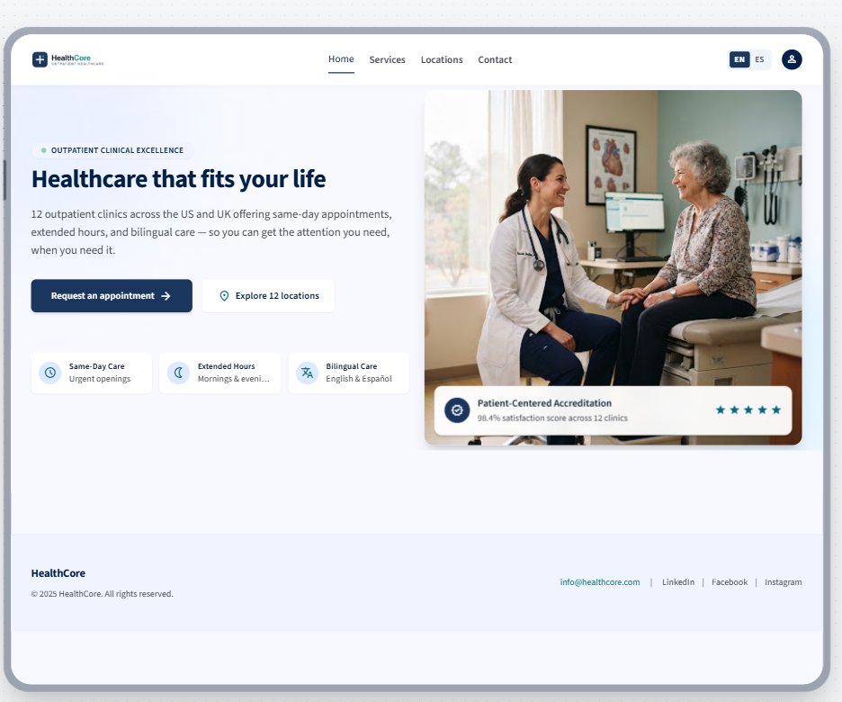
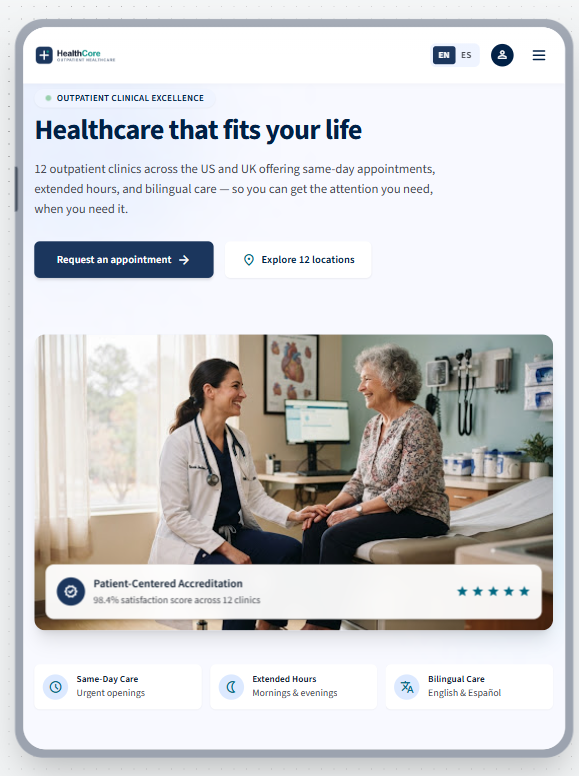
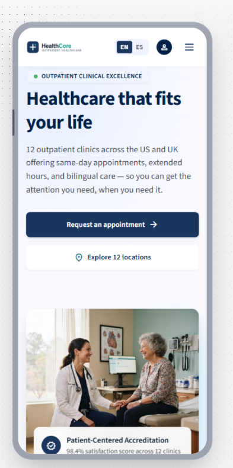
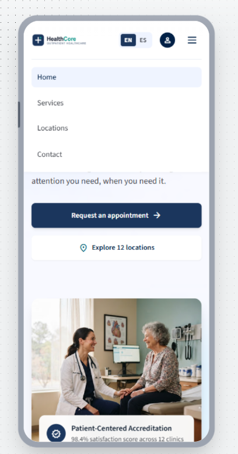
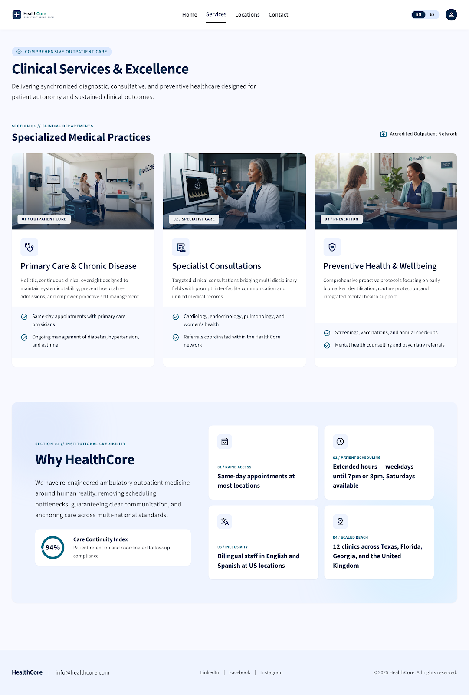
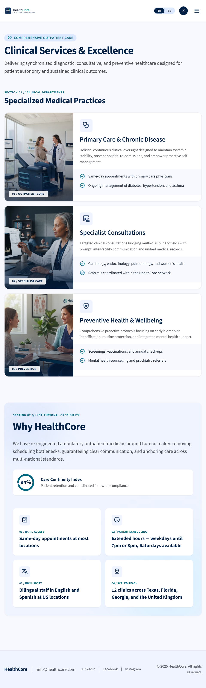
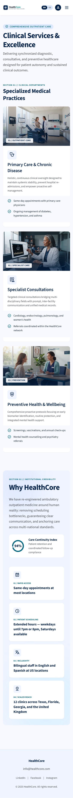

# HealthCore Public Website

This folder contains HealthCore's public-facing website for patients and visitors. It is separate from the future internal `backoffice` application under `uis/`.

## Current scope

The current milestone includes:

- A responsive home page for desktop, tablet, and mobile
- A shared header and footer loaded into each page with vanilla JavaScript
- A hamburger navigation menu for mobile and tablet
- Active navigation styling for standard `.html` and clean URLs
- A hero section with appointment and location calls to action
- Key outpatient care benefits
- A contact call to action and professional footer
- A responsive Services page with three specialized medical practice cards and a Why HealthCore section
- Placeholder pages for Locations and Contact

Detailed Locations, Contact, and appointment enquiry experiences will be implemented in later milestones.

## Technology

- Semantic HTML5
- Tailwind CSS through the CDN
- Lucide icons through the CDN
- Vanilla JavaScript for loading shared components, responsive navigation, and active-page styling

No build step is currently required.

## Project structure

```text
website/
├── index.html
├── services.html
├── locations.html
├── contact.html
├── application.html
├── README.md
├── components/
│   ├── header.html
│   └── footer.html
├── css/
├── js/
│   ├── components.js
│   ├── main.js
│   ├── tailwind-config.js
│   └── validation.js
└── public/
    ├── images/
    │   ├── home-hero.jpg
    │   ├── preventive-care.jpg
    │   ├── preventive-care-tablet.jpg
    │   ├── primary-care.jpg
    │   ├── primary-care-tablet.jpg
    │   ├── specialist-care.jpg
    │   └── specialist-care-tablet.jpg
    └── screenshots/
        ├── home/
        │   ├── home_desktop.PNG
        │   ├── home_mobile.PNG
        │   ├── home_mobile_tablet_menu.PNG
        │   └── home_tablet.PNG
        └── services/
            ├── services_destop.png
            ├── services_mobile.png
            └── services_tablet.png
```

- `components/header.html` and `components/footer.html` contain the reusable site layout.
- `js/components.js` loads the shared components and controls navigation behavior.
- `js/tailwind-config.js` contains the shared Tailwind theme configuration.
- `js/main.js` is reserved for future page-specific behavior.
- `application.html` and `js/validation.js` are reserved for the future appointment enquiry form.
- `css/` is reserved for custom styles that are not covered by Tailwind utilities.
- `public/screenshots/` contains the responsive UI/UX references for each implemented page.

## Run the website

From the repository root, start a local static server with:

```powershell
npx serve uis/website
```

The first run may ask for permission to download the `serve` package. This package is run through the npm cache and is not added to the project dependencies.

Open the local URL printed in the terminal, usually:

```text
http://localhost:3000
```

Press `Ctrl+C` in the terminal to stop the server.

Alternatively, run the website with Python without downloading an npm package:

```powershell
python -m http.server 8000 --directory uis/website
```

Then open `http://localhost:8000`.

## HealthCore UI/UX reference

### Home

The screenshots in [`public/screenshots/home`](./public/screenshots/home/) are the visual reference for implementing and reviewing the HealthCore home page. The interface uses a calm healthcare palette with navy primary actions, teal accents, pale blue surfaces, generous whitespace, and clear typography.

#### Desktop



- The top header displays the compact HealthCore logo, centered navigation links, language selector, and account icon.
- The hero uses a two-column layout: headline, description, calls to action, and benefits on the left; patient photography and accreditation details on the right.
- The footer places company information on the left and contact and social links on the right.

#### Tablet



- The hero changes to a single-column layout, with the text and actions above the image.
- The main navigation moves into a hamburger menu while the logo, language selector, and account icon remain visible.
- Benefit items remain in a three-column row beneath the hero image.

#### Mobile



- Content is stacked vertically for a narrow viewport, with readable spacing and no horizontal scrolling.
- Both calls to action become full-width controls for easier touch interaction.
- The hero image follows the text and actions, while the accreditation panel remains overlaid near the bottom of the image.

#### Mobile and tablet menu



- The hamburger opens the primary navigation directly beneath the top header.
- Home, Services, Locations, and Contact appear as large vertical menu targets.
- The active page uses a pale blue background, and the menu does not replace or hide the header controls.

### Services

The screenshots in [`public/screenshots/services`](./public/screenshots/services/) are the visual reference for implementing and reviewing the Services page. The design continues the navy and teal palette with a pale page background, white medical practice cards, and a rounded Why HealthCore panel with soft blue corner glows.

The page introduces Clinical Services & Excellence, followed by Specialized Medical Practices and Why HealthCore. The three practice cards cover primary care and chronic disease, specialist consultations, and preventive health and wellbeing. Why HealthCore presents the care continuity metric and four benefits: same-day access, extended hours, bilingual care, and the clinic network. The 94% metric reproduces the reference design's sample content.

#### Desktop



- The header displays the logo, navigation with Services highlighted, language selector, and account icon.
- Three medical practice cards sit side by side, each with a photo and category label above its icon, heading, description, and shaded list of included services.
- The reference places an Accredited Outpatient Network label beside the clinical departments heading.
- Why HealthCore uses two columns: the introduction and care continuity metric on the left, and a two-by-two benefit card grid on the right.
- The reference footer places the brand and email on the left, social links in the center, and copyright on the right.

#### Tablet



- The navigation moves into a hamburger menu while the logo, language selector, and account icon remain visible.
- Medical practice cards stack vertically and use a horizontal layout, with photography on the left and service details on the right. Tablet-specific images support this taller crop.
- The Why HealthCore introduction and full-width metric card appear above a two-column benefit grid.
- The reference footer keeps brand, contact, social links, and copyright in a horizontal arrangement, allowing text to wrap.

#### Mobile



- The introduction wraps to fit the narrow viewport, and medical practice cards stack in a single column with photography above the details.
- Why HealthCore stacks the introduction, metric, and all four benefit cards vertically, with padding between the content and the rounded panel edges.
- Card heights adapt to their text, keeping longer benefits readable without clipping.
- The compact header retains the language selector, account icon, and hamburger menu.
- The reference footer centers the brand, email, social links, and copyright in separate rows.

These screenshots describe the target design; they do not establish an exact visual match for the current implementation. The shared footer currently groups copyright beneath the brand and email with the social links, and the desktop accreditation label is not yet implemented.
